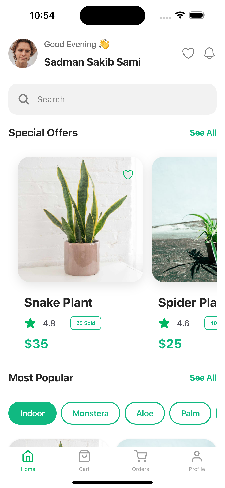
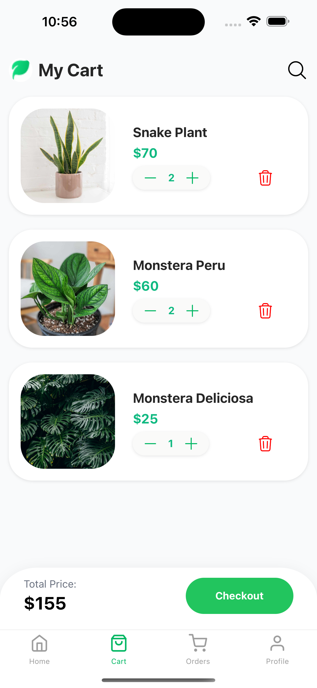
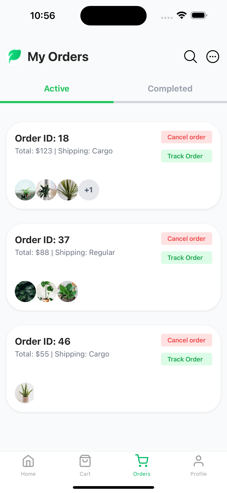

# Plant E-Commerce App

## Project Overview

**Plant E-Commerce App** is a mobile-first application designed to provide a seamless shopping experience for plant enthusiasts. This app offers secure user authentication, a dynamic cart system, and an intuitive checkout process, ensuring a smooth and engaging user experience.

### **Frontend:**

- Developed using **React Native** to create a responsive and engaging mobile application.
- Managed state efficiently with **React-Redux** and **Redux-Saga** as middleware.
- Implemented a dynamic and user-friendly **cart and checkout system**.

### **Backend:**

- Built with **Spring Boot**, ensuring secure and robust API services.
- Utilized **MySQL** to handle data persistence effectively.

_Backend implementation details and instructions can be found in the [Backend Repository](https://github.com/sam002696/plant-ecom-service)._

---

## Features and Technologies

### **Key Features:**

- **Secure Authentication:**

  - JWT-based authentication for secure user login and registration.

- **Dynamic Cart System:**

  - Add, remove, and update items in the cart seamlessly.
  - Display order summaries, shipping costs, and user details dynamically.

- **Active Orders Page:**

  - Track ongoing purchases with real-time updates.
  - Optimized API interactions for smooth navigation.

- **Mobile-First Design:**
  - Designed with a focus on usability and performance on mobile devices.

### **Technologies Used:**

- **Frontend:** React Native, React-Redux, Redux-Saga
- **Backend:** Spring Boot, MySQL
- **Authentication:** JWT

---

## Repository Structure

This project is organized into a single **frontend module** for better clarity and maintenance.  
For backend logic, APIs, and database integration, refer to the [Backend Repository](https://github.com/sam002696/plant-ecom-service).

---

## Workflow Overview

1. Users register and log in securely using JWT-based authentication.
2. Add plants to the cart and proceed to checkout with a real-time summary.
3. View and track active orders directly from the application.

---

## Deployment Instructions

### **Prerequisites:**

- A local environment set up for **React Native** development.
- **Node.js** and **npm/yarn** installed.
- Backend service running locally or on a server (refer to the [Backend Repository](https://github.com/sam002696/plant-ecom-service)).

### **Steps:**

1. **Clone the Repository:**

```bash
   git clone https://github.com/your-frontend-repository-link
```

2. **Install Dependencies:**

Navigate to the frontend folder and run:

```bash
cd frontend
npm install
```

3. **Start the Application:**

Run the following command to start the React Native app:

```bash
npm start
```

4. **Connect to Backend:**

Ensure the Spring Boot backend is running and the API endpoints are accessible. Update the base API URL in the frontend configuration if necessary. For backend setup instructions, refer to the [Backend Repository](https://github.com/sam002696/plant-ecom-service).

---

## Project Pictures

<p align="center">
  
  
  
</p>

---

## Contributing

We welcome contributions! Feel free to fork the repository and submit a pull request for review. Suggestions for improvement are always appreciated.
